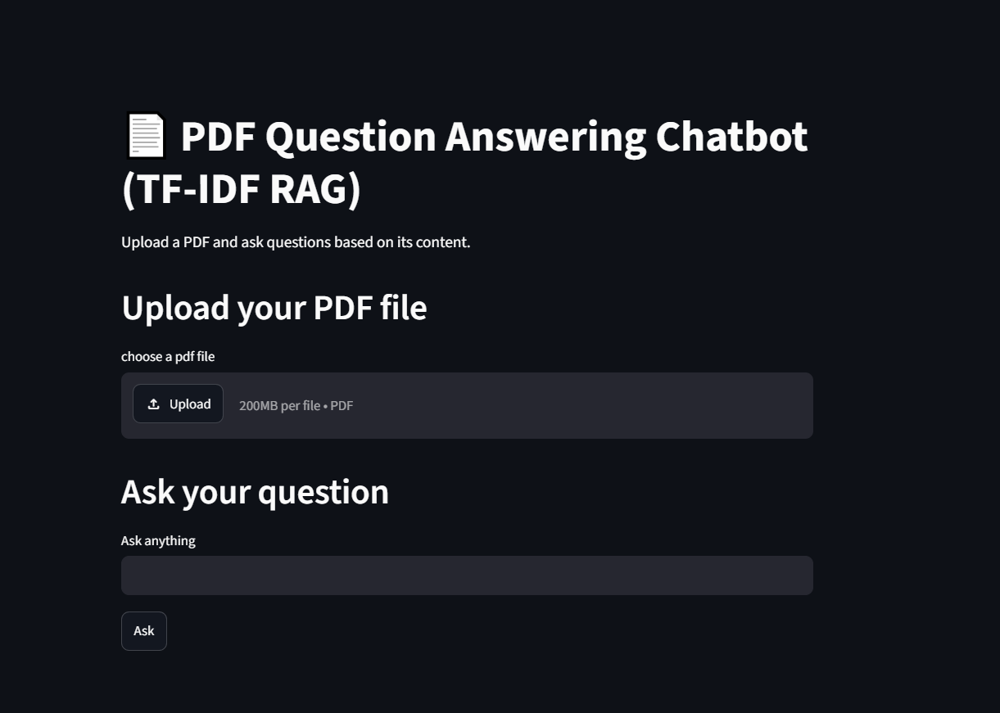
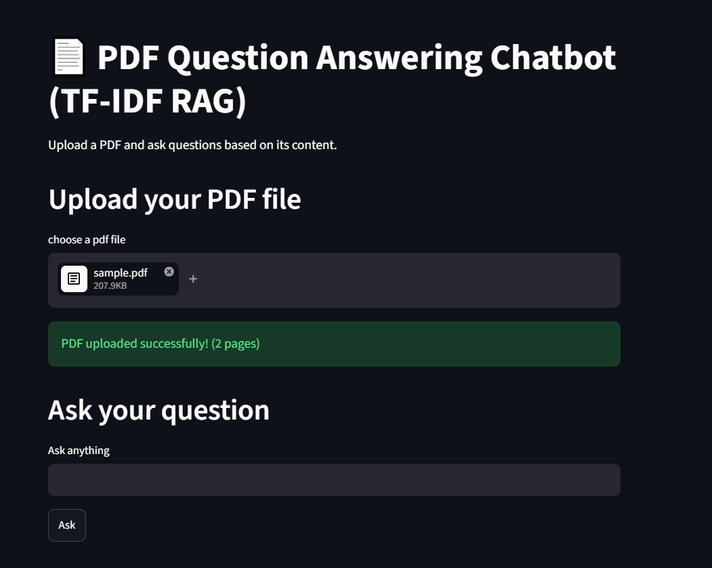

# 📚 Context-Aware Intelligent FAQ Chatbot (TF-IDF RAG)

A simple Retrieval-Augmented Generation (RAG) chatbot built with Python and Streamlit.

The chatbot allows users to upload a PDF and ask questions based on its content. It retrieves the most relevant information using TF-IDF Vectorization and Cosine Similarity.

---

## Features

- Upload PDF documents
- Extract text from PDF
- Text preprocessing using NLTK
- Sentence chunking
- TF-IDF Vectorization
- Cosine Similarity Search
- Chat History
- Simple Streamlit UI

---

## Technologies Used

- Python
- Streamlit
- NLTK
- Scikit-learn
- PyPDF

---

## Screenshots

### Home Page



---

### PDF Uploaded



---

### Chat History


---

### Question


---

## Project Structure

```
RAG-Chatbot/
│
├── app.py
├── requirements.txt
├── README.md
│
├── utils/
│   ├── preprocess.py
│   └── search.py
```

---

## How to Run

Install dependencies:

```bash
pip install -r requirements.txt
```

Run:

```bash
streamlit run app.py
```

---

## Future Improvements

- Replace TF-IDF with Sentence Embeddings
- Use FAISS Vector Database
- Support multiple PDFs
- Add LLM-based answer generation

---

## Author

Himanshi Thakur
